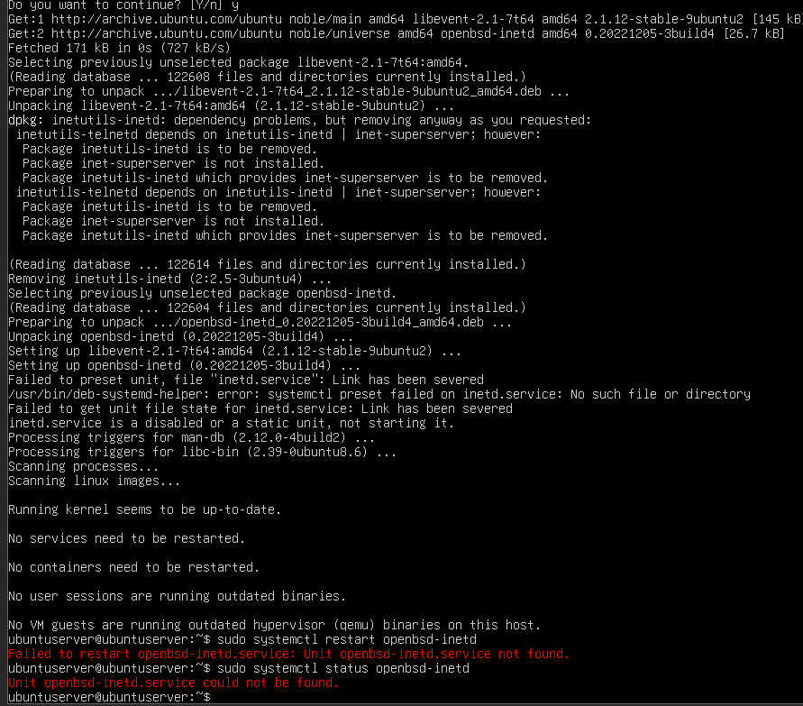
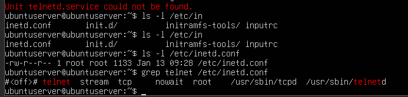
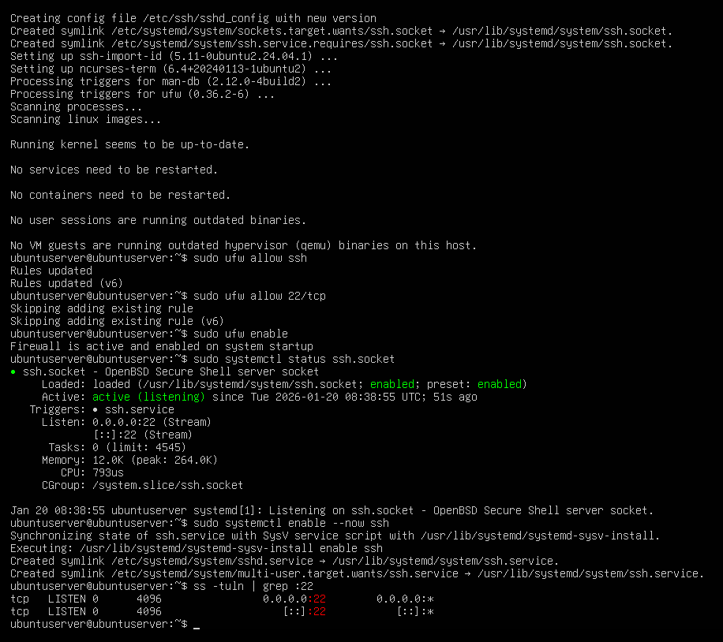

# Probleme

### Telnet hat nicht funktioniert:

Das installierte Telnet unit konnte nicht gefunden werden


Telnet war aus?


Wir mussten den Telnet "Superserver" installieren:

```bash
sudo apt install telnetd inetutils-inetd -y
```

Danach hat Telnet funktioniert:


---